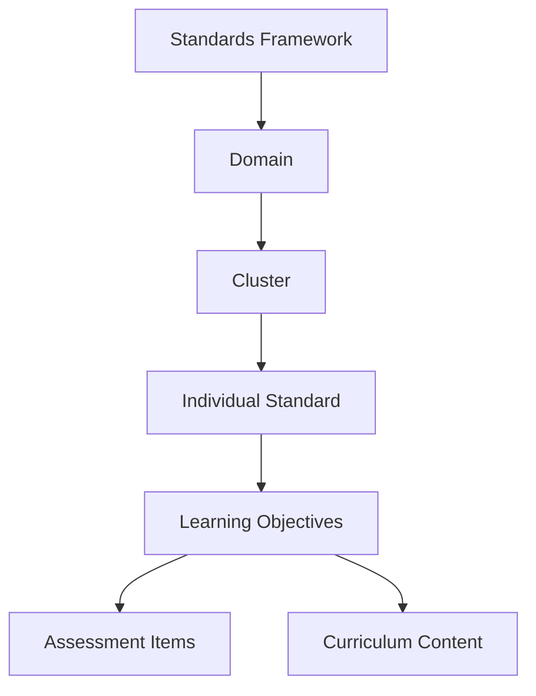

# Academic Standards Overview

Academic standards serve as the foundational framework for educational content alignment and quality assurance within our knowledge graph system. This overview explains how standards are structured, implemented, and utilized across the platform.

## What are Academic Standards?

Academic standards are authoritative statements that define what students should know and be able to do at specific grade levels or developmental stages. They provide:

- **Learning expectations** that guide curriculum development
- **Assessment criteria** for measuring student progress
- **Alignment targets** for educational content and activities
- **Quality benchmarks** for instructional materials

## Standards in the Knowledge Graph

Our knowledge graph integrates multiple standards frameworks to create a comprehensive educational ecosystem:

### Supported Standards Frameworks

<CardGroup cols={2}>
  <Card title="Common Core State Standards" icon="book">
    Mathematics and English Language Arts standards for K-12 education
  </Card>
  <Card title="Next Generation Science Standards" icon="flask">
    Performance expectations for science education across grade levels
  </Card>
  <Card title="State-Specific Standards" icon="map">
    Custom standards frameworks adopted by individual states
  </Card>
  <Card title="International Standards" icon="globe">
    Global education frameworks including IB and Cambridge curricula
  </Card>
</CardGroup>

## Key Features

### Standards Mapping
- **Cross-framework alignment** to identify equivalent standards across different systems
- **Granular tagging** of content to specific standard elements
- **Gap analysis** to identify missing coverage areas
- **Progression tracking** to show learning sequences

### Quality Assurance
- **Automated validation** of standards alignment claims
- **Expert review workflows** for content approval
- **Version control** to track standards updates and revisions
- **Compliance reporting** for educational stakeholders

### Analytics and Insights
- **Coverage analysis** showing standards implementation across curricula
- **Performance correlations** between standards-aligned content and outcomes
- **Usage patterns** highlighting frequently accessed standards
- **Effectiveness metrics** for standards-based instruction

## Implementation Architecture

## Getting Started

<Steps>
  <Step title="Explore Standards Frameworks">
    Browse the available standards frameworks and understand their structure
  </Step>
  <Step title="Review Data Models">
    Examine how standards are represented in our knowledge graph
  </Step>
  <Step title="Understand Alignment">
    Learn how content is aligned to specific standards
  </Step>
  <Step title="Access APIs">
    Integrate standards data into your applications
  </Step>
</Steps>

## Use Cases

### For Curriculum Developers
- Ensure comprehensive standards coverage
- Identify prerequisite relationships
- Create aligned assessment items
- Track learning progressions

### For Educators
- Find standards-aligned resources
- Plan instruction based on requirements
- Monitor student progress against standards
- Generate compliance reports

### For Administrators
- Analyze curriculum alignment
- Track implementation effectiveness
- Ensure regulatory compliance
- Make data-driven decisions

## Best Practices

<Warning>
Always verify standards alignment with official framework documentation. Our system provides guidance but final responsibility lies with content creators.
</Warning>

<Tip>
Use the standards hierarchy to understand prerequisite relationships and create logical learning sequences.
</Tip>

## Next Steps

Ready to dive deeper? Explore the detailed [Data model for standards](/knowledge-graph/data-model-standards) to understand the technical implementation. 