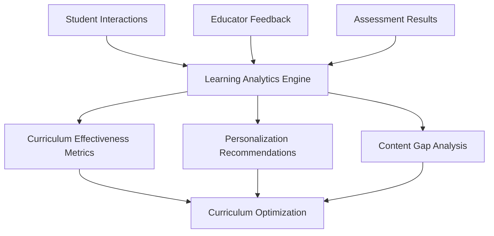

# Curriculum Overview

Curriculum represents the organized framework of educational experiences designed to achieve specific learning outcomes. Within our knowledge graph system, curriculum serves as the orchestrating layer that sequences, structures, and delivers learning components in coherent, purposeful ways.

## What is Curriculum in the Knowledge Graph?

Curriculum in our system is more than just a collection of lessons or activities. It represents:

- **Structured learning pathways** that guide student progression
- **Coherent sequences** of educational experiences
- **Standards-aligned frameworks** ensuring quality and compliance
- **Adaptive structures** that respond to individual learner needs

## Curriculum Architecture

Our knowledge graph organizes curriculum into hierarchical structures that support both traditional and innovative educational approaches:

### Curriculum Hierarchy

<CardGroup cols={2}>
  <Card title="Curriculum Framework" icon="sitemap">
    The overarching structure organizing all educational content
  </Card>
  <Card title="Course Sequences" icon="list-ol">
    Subject-specific progressions across grade levels or competency areas
  </Card>
  <Card title="Instructional Units" icon="folder">
    Thematic groupings of related learning experiences
  </Card>
  <Card title="Learning Sessions" icon="clock">
    Individual lessons or instructional episodes
  </Card>
</CardGroup>

## Key Features

### Flexible Structuring
- **Multiple organizational patterns** (chronological, thematic, competency-based)
- **Cross-curricular connections** linking subjects and disciplines
- **Modular design** enabling component reuse and adaptation
- **Version control** for curriculum updates and iterations

### Standards Integration
- **Automatic alignment** to educational standards frameworks
- **Gap analysis** identifying missing coverage areas
- **Compliance tracking** ensuring regulatory requirements
- **Cross-framework mapping** supporting diverse standards systems

### Personalization Engine
- **Adaptive sequencing** based on learner profiles
- **Differentiated pathways** for varied learning needs
- **Pacing flexibility** accommodating different learning speeds
- **Interest-based branches** increasing engagement and motivation

## Curriculum Types

<Tabs>
  <Tab title="Traditional Scope & Sequence">
    **Linear progression** through predefined content sequences
    - Grade-level organization
    - Subject-based structure
    - Chronological pacing
    - Standardized assessments
  </Tab>
  <Tab title="Competency-Based">
    **Mastery-focused** progression through skill development
    - Learning outcome emphasis
    - Flexible pacing
    - Demonstrated proficiency
    - Continuous assessment
  </Tab>
  <Tab title="Project-Based">
    **Experience-centered** learning through authentic tasks
    - Real-world applications
    - Interdisciplinary connections
    - Collaborative learning
    - Portfolio assessment
  </Tab>
  <Tab title="Personalized Learning">
    **Individual-adaptive** pathways based on learner characteristics
    - AI-driven recommendations
    - Learning style accommodation
    - Interest-based selection
    - Competency mapping
  </Tab>
</Tabs>

## Implementation Framework

### Curriculum Development Process

<Steps>
  <Step title="Needs Analysis">
    Identify learning goals, standards requirements, and learner characteristics
  </Step>
  <Step title="Framework Design">
    Create the overall structure and organizational principles
  </Step>
  <Step title="Content Mapping">
    Align learning components to curriculum elements
  </Step>
  <Step title="Sequence Optimization">
    Order content for maximum learning effectiveness
  </Step>
  <Step title="Assessment Integration">
    Embed formative and summative evaluation points
  </Step>
  <Step title="Pilot Testing">
    Validate curriculum effectiveness with target populations
  </Step>
  <Step title="Iterative Refinement">
    Continuously improve based on data and feedback
  </Step>
</Steps>

## Quality Assurance

### Curriculum Validation

<Note>
All curriculum structures undergo comprehensive review to ensure educational effectiveness, standards alignment, and learner appropriateness.
</Note>

#### Validation Dimensions
- **Pedagogical soundness** based on learning science research
- **Content accuracy** verified by subject matter experts
- **Developmental appropriateness** for target age groups
- **Cultural responsiveness** ensuring inclusive representation
- **Accessibility compliance** supporting diverse learners

### Continuous Improvement
- **Learning analytics** tracking student progress and outcomes
- **Educator feedback** from implementation experiences
- **Performance benchmarking** against similar curricula
- **Research integration** incorporating latest educational findings

## Curriculum Analytics

### Key Metrics
- **Completion rates** across curriculum sequences
- **Learning velocity** showing progression speed
- **Mastery levels** indicating depth of understanding
- **Engagement patterns** revealing student interest
- **Dropout points** identifying challenging transitions

## Use Cases

### For Curriculum Directors
- **System-wide planning** ensuring coherent educational experiences
- **Standards compliance** meeting regulatory requirements
- **Resource allocation** optimizing instructional materials
- **Quality assurance** maintaining educational effectiveness

### For Instructional Coordinators
- **Scope and sequence** development for subject areas
- **Cross-curricular** integration planning
- **Professional development** alignment with curriculum goals
- **Assessment coordination** ensuring evaluation coherence

### For Teachers
- **Lesson planning** within curriculum frameworks
- **Learning progression** tracking for individual students
- **Differentiation strategies** adapting to learner needs
- **Progress monitoring** using curriculum-embedded assessments

### For Students and Families
- **Learning pathway** visibility and planning
- **Progress tracking** against curriculum milestones
- **Goal setting** aligned with curriculum expectations
- **Resource access** supporting home learning

## Technology Integration

### Digital Curriculum Features
- **Interactive content** engaging multiple learning modalities
- **Real-time adaptation** responding to student performance
- **Multimedia resources** supporting diverse learning preferences
- **Collaborative tools** enabling peer learning experiences

### API and Integration
- **Curriculum APIs** for third-party system integration
- **Data standards** ensuring interoperability
- **Export capabilities** supporting various formats
- **Sync protocols** maintaining consistency across platforms

## Best Practices

<Tip>
Design curriculum with clear learning progressions that build systematically from foundational to advanced concepts.
</Tip>

<Warning>
Avoid curriculum structures that are too rigid or too loose. Balance structure with flexibility to meet diverse learner needs.
</Warning>

### Design Principles
- **Backward design** starting with desired outcomes
- **Coherent progression** building knowledge systematically
- **Multiple pathways** accommodating different learners
- **Authentic assessment** measuring real-world application
- **Continuous feedback** enabling course corrections

## Next Steps

Ready to explore the technical details? Review the [Data model for curriculum](/knowledge-graph/data-model-curriculum) to understand how curriculum structures are implemented in our knowledge graph system. 