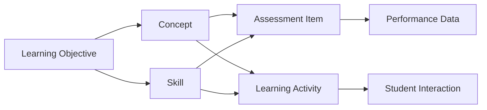

# Learning Components Overview

Learning components are the fundamental units of educational content and experience within our knowledge graph. They represent the atomic elements that combine to create comprehensive learning pathways and educational outcomes.

## What are Learning Components?

Learning components are discrete, measurable elements that contribute to the educational process. They include:

- **Concepts** - Abstract ideas and principles students need to understand
- **Skills** - Practical abilities students need to develop
- **Knowledge** - Factual information students need to acquire
- **Competencies** - Integrated applications of concepts, skills, and knowledge

## Component Types in the Knowledge Graph

Our system organizes learning components into several interconnected categories:

### Core Component Types

<CardGroup cols={2}>
  <Card title="Learning Objectives" icon="target">
    Specific, measurable goals that define what students should achieve
  </Card>
  <Card title="Conceptual Knowledge" icon="lightbulb">
    Abstract ideas, theories, and principles that form understanding
  </Card>
  <Card title="Procedural Skills" icon="gears">
    Step-by-step abilities and methods students can apply
  </Card>
  <Card title="Assessment Items" icon="check-circle">
    Questions and tasks that measure learning progress and mastery
  </Card>
</CardGroup>

## Key Features

### Relationship Mapping
- **Prerequisite chains** showing learning dependencies
- **Skill progressions** from basic to advanced levels
- **Concept hierarchies** organizing knowledge domains
- **Cross-curricular connections** linking related components

### Adaptive Pathways
- **Personalized sequencing** based on student needs
- **Difficulty adjustment** matching learner capabilities
- **Multiple entry points** for different starting levels
- **Remediation branches** for struggling learners

### Progress Tracking
- **Mastery indicators** showing competency levels
- **Learning analytics** revealing usage patterns
- **Performance correlations** between components
- **Predictive modeling** for success outcomes

## Component Architecture

## Implementation Framework

### Granularity Levels

<Tabs>
  <Tab title="Macro Level">
    **Course-wide components** that span entire subjects or grade levels
    - Major learning goals
    - Overarching themes
    - Year-long projects
  </Tab>
  <Tab title="Meso Level">
    **Unit-based components** that organize related concepts and skills
    - Chapter objectives
    - Skill clusters
    - Thematic assessments
  </Tab>
  <Tab title="Micro Level">
    **Lesson-specific components** that address immediate learning needs
    - Daily objectives
    - Individual concepts
    - Single-skill practice
  </Tab>
</Tabs>

## Component Lifecycle

<Steps>
  <Step title="Component Definition">
    Identify and formally describe the learning element
  </Step>
  <Step title="Relationship Mapping">
    Connect to prerequisites, standards, and related components
  </Step>
  <Step title="Content Creation">
    Develop instructional materials and assessment items
  </Step>
  <Step title="Implementation">
    Deploy component within learning pathways
  </Step>
  <Step title="Data Collection">
    Gather performance and engagement metrics
  </Step>
  <Step title="Optimization">
    Refine component based on evidence and outcomes
  </Step>
</Steps>

## Use Cases

### For Instructional Designers
- **Modular content creation** using reusable components
- **Learning pathway design** with clear progressions
- **Assessment alignment** to specific learning elements
- **Adaptive system configuration** for personalized learning

### For Educators
- **Lesson planning** with component-based objectives
- **Progress monitoring** at granular levels
- **Intervention targeting** for specific skill gaps
- **Differentiation strategies** using component alternatives

### For Learners
- **Clear learning targets** with specific objectives
- **Self-paced progression** through component sequences
- **Skill development tracking** with visual feedback
- **Personalized recommendations** based on component mastery

## Quality Assurance

<Note>
All learning components undergo rigorous validation to ensure educational effectiveness and alignment with pedagogical best practices.
</Note>

### Validation Criteria
- **Learning science alignment** with cognitive research
- **Standards compliance** with educational frameworks
- **Accessibility requirements** for diverse learners
- **Cultural responsiveness** and inclusive design

## Analytics and Insights

### Component Performance Metrics
- **Engagement rates** showing student interaction levels
- **Mastery rates** indicating learning effectiveness
- **Time-to-completion** for component sequences
- **Error patterns** revealing common misconceptions

### System Optimization
- **A/B testing** of component variations
- **Machine learning** for pathway optimization
- **Predictive analytics** for early intervention
- **Recommendation engines** for content suggestions

## Best Practices

<Tip>
Design components to be atomic and reusable. A well-designed component should address a single, clear learning objective.
</Tip>

<Warning>
Avoid creating components that are too broad or too narrow. Find the optimal granularity for your specific educational context.
</Warning>

## Next Steps

Explore the detailed [Data model for learning components](/knowledge-graph/data-model-learning-components) to understand the technical structure and relationships within our system. 