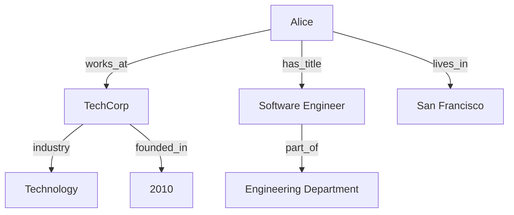

# Getting Started with Knowledge Graphs

<Info>
  **You are viewing version 1.0** - This is the stable release of the Knowledge Graph documentation. For the latest features, see [version 1.1](/knowledge-graph/v1.1/getting-started).
</Info>

<Warning>
  **This is a placeholder page** - This content is for demonstration purposes only and will be replaced with actual documentation.
</Warning>

Welcome to Knowledge Graphs v1.0! This guide will help you understand how to create, manage, and query knowledge graphs to represent complex relationships in your data.

## What is a Knowledge Graph?

A knowledge graph is a network of real-world entities and their relationships, represented as:
- 🔗 **Entities** - People, places, concepts, or things
- ↔️ **Relationships** - How entities connect to each other
- 🏷️ **Properties** - Attributes and metadata about entities
- 📊 **Schema** - Structure and rules governing the graph

## Quick Start

### Step 1: Initialize Your Knowledge Graph

```python
from knowledge_graph import KnowledgeGraph

# Create a new knowledge graph
kg = KnowledgeGraph(name="my-first-kg")

# Add some entities
kg.add_entity("Alice", type="Person")
kg.add_entity("TechCorp", type="Company")
kg.add_entity("Software Engineer", type="JobTitle")
```

### Step 2: Define Relationships

```python
# Create relationships between entities
kg.add_relationship(
    source="Alice", 
    relation="works_at", 
    target="TechCorp"
)

kg.add_relationship(
    source="Alice", 
    relation="has_title", 
    target="Software Engineer"
)
```

### Step 3: Query Your Graph

```cypher
// Find all people who work at TechCorp
MATCH (person:Person)-[:works_at]->(company:Company)
WHERE company.name = "TechCorp"
RETURN person.name
```

## Core Concepts

<CardGroup cols={2}>
  <Card title="Entities & Nodes" icon="circle-dot">
    The fundamental building blocks representing real-world objects
  </Card>
  <Card title="Relationships & Edges" icon="arrow-right-arrow-left">
    Connections that define how entities relate to each other
  </Card>
  <Card title="Properties & Attributes" icon="tags">
    Metadata and characteristics associated with entities
  </Card>
  <Card title="Schema & Ontology" icon="sitemap">
    Structure and rules that govern your knowledge graph
  </Card>
</CardGroup>

## Example Knowledge Graph Structure



## Sample Query Results

| Entity | Type | Relationships | Properties |
|--------|------|---------------|------------|
| Alice | Person | works_at, has_title, lives_in | age: 28, email: alice@example.com |
| TechCorp | Company | employs, industry, founded_in | employees: 500, revenue: $50M |
| Software Engineer | JobTitle | requires_skills, salary_range | level: Senior, remote: true |

## Common Use Cases

### 🔍 **Knowledge Discovery**
Find hidden patterns and connections in your data

### 🤖 **AI & Machine Learning**
Enhance models with structured relationship data

### 📈 **Recommendation Systems**
Build personalized recommendations based on graph relationships

### 🔎 **Search & Analytics**
Enable semantic search and complex analytical queries

<Note>
  This is example content for v1.0! Replace with your actual knowledge graph documentation when ready.
</Note>

## Version 1.0 Features

This version includes:
- Basic knowledge graph creation and management
- Simple entity and relationship operations
- Standard query capabilities
- Core visualization tools

## Next Steps

1. [Design your graph schema](#)
2. [Import existing data](#)
3. [Basic querying techniques](#)
4. [Graph visualization basics](#)
5. [Performance fundamentals](#)

<Tip>
  Start small with a focused domain, then expand your knowledge graph as you learn more about your data relationships.
</Tip>

## Resources

- [Graph Database Fundamentals](#)
- [SPARQL Query Language](#)
- [Cypher Query Examples](#)
- [Schema Design Best Practices](#) 