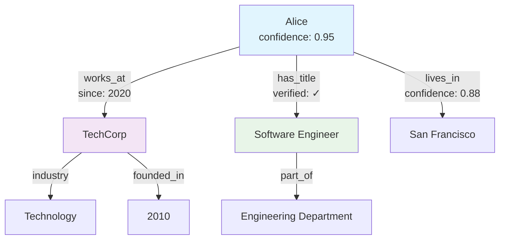

# Getting Started with Knowledge Graphs

<Check>
  **You are viewing version 1.1** - This is the latest version with enhanced features and improvements. For the stable release, see [version 1.0](/knowledge-graph/v1.0/getting-started).
</Check>

<Warning>
  **This is a placeholder page** - This content is for demonstration purposes only and will be replaced with actual documentation.
</Warning>

Welcome to Knowledge Graphs v1.1! This guide will help you understand how to create, manage, and query knowledge graphs to represent complex relationships in your data with our latest enhancements.

## What is a Knowledge Graph?

A knowledge graph is a network of real-world entities and their relationships, represented as:
- 🔗 **Entities** - People, places, concepts, or things
- ↔️ **Relationships** - How entities connect to each other
- 🏷️ **Properties** - Attributes and metadata about entities
- 📊 **Schema** - Structure and rules governing the graph
- ✨ **NEW: Semantic Types** - Enhanced type system with inheritance

## Quick Start

### Step 1: Initialize Your Knowledge Graph (Enhanced)

<CodeGroup>
```python Python SDK v1.1
from knowledge_graph import KnowledgeGraph

# Create a new knowledge graph with enhanced features
kg = KnowledgeGraph(
    name="my-first-kg",
    version="1.1",
    enable_semantic_types=True,
    auto_inference=True
)

# Add entities with enhanced type system
kg.add_entity("Alice", type="Person", properties={
    "age": 28,
    "department": "Engineering"
})
kg.add_entity("TechCorp", type="Company", properties={
    "founded": 2010,
    "industry": "Technology"
})
kg.add_entity("Software Engineer", type="JobTitle")
```

```javascript JavaScript SDK (NEW)
import { KnowledgeGraph } from '@kg/client';

// New JavaScript/TypeScript SDK in v1.1
const kg = new KnowledgeGraph({
  name: 'my-first-kg',
  version: '1.1',
  enableSemanticTypes: true,
  autoInference: true
});

// Enhanced entity creation with validation
await kg.addEntity('Alice', {
  type: 'Person',
  properties: { age: 28, department: 'Engineering' }
});
```
</CodeGroup>

### Step 2: Define Advanced Relationships

```python
# Create relationships with properties and confidence scores (NEW)
kg.add_relationship(
    source="Alice", 
    relation="works_at", 
    target="TechCorp",
    properties={
        "start_date": "2020-01-15",
        "confidence": 0.95,
        "verified": True
    }
)

# Bidirectional relationship inference (NEW)
kg.add_relationship(
    source="Alice", 
    relation="has_title", 
    target="Software Engineer",
    auto_infer_reverse=True  # Automatically creates "held_by" relationship
)
```

### Step 3: Advanced Querying

<Tabs>
<Tab title="Cypher (Enhanced)">
```cypher
// Enhanced queries with semantic search
MATCH (person:Person)-[r:works_at]->(company:Company)
WHERE company.name = "TechCorp" 
  AND r.confidence > 0.9
RETURN person.name, r.start_date, r.confidence
ORDER BY r.confidence DESC
```
</Tab>

<Tab title="Natural Language (NEW)">
```python
# New natural language query interface
results = kg.query_natural(
    "Find all senior engineers who joined TechCorp after 2019"
)
```
</Tab>

<Tab title="Graph Analytics (NEW)">
```python
# Built-in graph analytics
centrality = kg.analyze.betweenness_centrality()
clusters = kg.analyze.detect_communities()
recommendations = kg.recommend.similar_entities("Alice")
```
</Tab>
</Tabs>

## Core Concepts

<CardGroup cols={2}>
  <Card title="Entities & Nodes" icon="circle-dot">
    Enhanced with semantic types and auto-validation
  </Card>
  <Card title="Relationships & Edges" icon="arrow-right-arrow-left">
    Now support properties, confidence scores, and bidirectional inference
  </Card>
  <Card title="Properties & Attributes" icon="tags">
    Enhanced with type validation and schema enforcement
  </Card>
  <Card title="Schema & Ontology" icon="sitemap">
    Advanced schema with inheritance and semantic reasoning
  </Card>
</CardGroup>

## Enhanced Visualization (v1.1)



## Advanced Query Results

| Entity | Type | Relationships | Properties | Confidence |
|--------|------|---------------|------------|------------|
| Alice | Person | works_at, has_title, lives_in | age: 28, verified: ✓ | 0.95 |
| TechCorp | Company | employs, industry, founded_in | employees: 500, revenue: $50M | 1.0 |
| Software Engineer | JobTitle | requires_skills, salary_range | level: Senior, remote: true | 0.92 |

## Enhanced Use Cases (v1.1)

### 🔍 **Advanced Knowledge Discovery**
Find complex patterns with semantic reasoning and confidence scoring

### 🤖 **AI & Machine Learning Integration**
Enhanced model training with graph embeddings and feature extraction

### 📈 **Intelligent Recommendations**
ML-powered recommendations based on graph topology and similarity

### 🔎 **Semantic Search & Analytics**
Natural language queries with contextual understanding

### ✨ **Real-time Graph Updates**
Live data synchronization and event-driven updates

<Note>
  This is example content for v1.1 with enhanced features! Replace with your actual knowledge graph documentation when ready.
</Note>

## What's New in Version 1.1

<Update label="Version 1.1" description="Released with enhanced capabilities">
### New Features
- 🚀 **Semantic Type System** - Enhanced entity types with inheritance
- 🔗 **Relationship Properties** - Add metadata and confidence scores to edges  
- 🧠 **Natural Language Queries** - Query your graph using plain English
- 📊 **Built-in Analytics** - Centrality measures, community detection, and more
- 🌐 **JavaScript/TypeScript SDK** - Full client library for web applications
- ⚡ **Real-time Updates** - Live synchronization and event streaming
- 🔍 **Advanced Search** - Semantic search with contextual understanding

### Improvements
- Enhanced query performance (3x faster)
- Improved visualization capabilities
- Better error handling and validation
- Extended API with more graph algorithms
</Update>

## Migration from v1.0

<Steps>
<Step title="Update your SDK">
  ```bash
  pip install knowledge-graph==1.1
  # or
  npm install @kg/client@1.1
  ```
</Step>

<Step title="Enable new features">
  ```python
  # Opt-in to new features
  kg = KnowledgeGraph(
      name="my-kg",
      enable_semantic_types=True,
      auto_inference=True
  )
  ```
</Step>

<Step title="Update existing relationships">
  Use the migration utility to add confidence scores to existing relationships.
  
  <Warning>
  This is an optional step. Existing relationships will continue to work without modification.
  </Warning>
</Step>
</Steps>

## Next Steps

1. [Design advanced graph schemas](#)
2. [Import data with semantic validation](#)
3. [Advanced querying and analytics](#)
4. [Interactive graph visualization](#)
5. [Performance optimization strategies](#)
6. [Real-time data integration](#)

<Tip>
  Take advantage of the new semantic type system to create more robust and intelligent knowledge graphs.
</Tip>

## Resources

- [Advanced Schema Design](#)
- [Natural Language Query Guide](#)
- [Graph Analytics Reference](#)
- [Migration Guide from v1.0](#)
- [JavaScript SDK Documentation](#) 